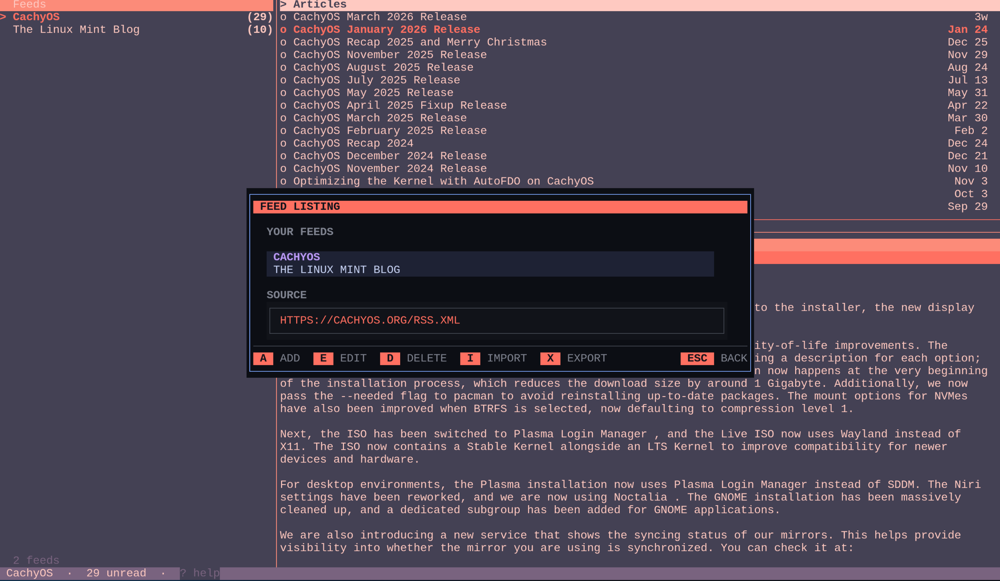

# Tide



A terminal RSS reader built with [Bubble Tea](https://github.com/charmbracelet/bubbletea) and [Lipgloss](https://github.com/charmbracelet/lipgloss).

## Features

- Three-pane layout: feeds, articles, content
- Live theme switching with full preview
- Theme-aware dialogs and overlays
- Feed manager: add, edit, delete, import/export OPML
- Google Reader-compatible source support, including FreshRSS
- Article search and filter
- Mark read/unread, open in browser
- AI summaries with copy and save-to-Markdown actions
- 17 built-in themes
- Terminal background sync (OSC 11)

## Themes

- `catppuccin-mocha`
- `catppuccin-latte`
- `catppuccin-frappe`
- `catppuccin-macchiato`
- `nord`
- `dracula`
- `gruvbox-dark`
- `gruvbox-light`
- `tokyo-night`
- `tokyo-night-day`
- `rose-pine`
- `rose-pine-moon`
- `rose-pine-dawn`
- `one-dark`
- `magenta-geode`
- `coral-sunset`
- `lavender-fields-forever`

## Installation

```bash
curl -fsSL https://raw.githubusercontent.com/allisonhere/tide/main/install.sh | sh
```

Installs to `/usr/local/bin` by default. To install elsewhere:

```bash
INSTALL_DIR=~/.local/bin curl -fsSL https://raw.githubusercontent.com/allisonhere/tide/main/install.sh | sh
```

Or build from source:

```bash
git clone https://github.com/allisonhere/tide
cd tide
go build -o tide .
```

## Usage

```bash
tide
```

Config and database are stored in `~/.config/rss/`.

## Feed Manager And Sources

Open the feed manager with `m`. Tide keeps one shared manager flow for local feeds and Google Reader-compatible sources.

- Press `a` to open the add dialog from anywhere
- The add dialog starts on the left list/details pane; press `Enter`, `→`, or `Tab` to move into the form
- From a text field, `←` moves back to the left pane once the cursor is already at the start of the field
- The `Source` toggle in the add form switches between `Local` and `GReader`

Local source:
- `Title`, `URL`, folder, and color behave like the normal Tide add/edit flow

GReader source:
- Uses the same add dialog with `Title`, optional feed `URL`, `API URL`, `Login`, and `Password`
- If `URL` is blank, Tide saves the source connection and loads your existing remote subscriptions
- If `URL` is set, Tide also quick-adds that subscription on the remote server
- Selecting a remote feed in the manager shows the current saved GReader connection info on the right, with the password masked

FreshRSS works through its Google Reader-compatible endpoint. Use the full API URL, for example:

```text
https://example.com/FreshRSS/p/api/greader.php
```

Saved Google Reader credentials are stored in `~/.config/rss/config.toml` under `[source]`.

## Settings

Open settings with `S`.

The settings overlay uses a category list on the left and a focused detail pane on the right. Current categories are `DISPLAY`, `FEEDS`, `UPDATES`, `AI`, and `ABOUT`.

Display options:
- Toggle Unicode icons for pane headers and item state markers
- Switch between relative and absolute dates
- Toggle mark-read-on-open
- Set a custom browser command

Feed options:
- Set the maximum feed body size accepted during parsing

Update options:
- Toggle startup update checks
- Check for the latest Tide release manually
- Install the latest release in place when the current binary path is writable
- If admin permission is required, Tide shows the exact install command to run

AI summary options:
- Provider: `none`, `OpenAI`, `Claude`, `Gemini`, or `Ollama`
- API key for OpenAI, Claude, or Gemini
- Ollama URL and model for local summaries
- Save path for exported Markdown summaries

About:
- Open the Tide repository and issues page from inside Settings
- Includes a small signed note and project tagline

Settings are saved to `~/.config/rss/config.toml`.

## AI Summaries

Tide can summarize the currently selected article when focus is in the `Articles` or `Content` pane.

- Press `s` to open an AI summary for the selected article
- Press `c` in the summary dialog to copy the summary
- Press `m` in the summary dialog to save it as `.md`
- If AI is not configured, Tide shows a prompt to open Settings with `S`

Supported providers and current built-in models:
- OpenAI
  Uses `gpt-4o-mini`
- Claude
  Uses `claude-haiku-4-5-20251001`
- Gemini
  Uses `gemini-1.5-flash`
- Ollama
  Uses your configured local model, default `llama3.2`

Provider requirements:
- OpenAI: set an OpenAI API key
- Claude: set an Anthropic API key
- Gemini: set a Google AI Studio API key
- Ollama: run a local Ollama server and choose a model

Summary behavior:
- Tide sends the article title and up to the first 4000 characters of article content
- The app asks the provider for a concise 3-5 sentence summary
- Requests use a 30 second timeout
- Generated summaries are cached per article and can be reopened without regenerating them
- Saved summaries are written as Markdown files to your configured save path

Default Ollama settings:
- URL: `http://localhost:11434`
- Model: `llama3.2`

Example `config.toml`:

```toml
theme = "catppuccin-mocha"

[display]
icons = false
date_format = "relative"
mark_read_on_open = true
browser = ""

[feed]
max_body_mib = 10

[ai]
provider = "ollama" # openai | claude | gemini | ollama | ""
openai_key = ""
claude_key = ""
gemini_key = ""
ollama_url = "http://localhost:11434"
ollama_model = "llama3.2"
save_path = "~/"

[source]
greader_url = ""
greader_login = ""
greader_password = ""
```

Feed fetch limits:
- `feed.max_body_mib` controls the maximum feed response size accepted for parsing
- Default is `10`
- If a feed exceeds this limit, Tide returns a clear “feed is too large to parse” error instead of a misleading XML syntax error

## Self Updates

Tide can check GitHub releases for a newer version and install the matching binary for your platform.

- Startup checks are enabled by default and run at most once every 24 hours
- Manual checks and installs live in the `UPDATES` section of Settings (`S`)
- Tide never downloads or installs an update until you explicitly choose `Update now`
- After a successful install, Tide offers `Restart now`
- If the install target needs elevated permissions, Tide shows a manual `sudo install ...` command instead of failing silently

## Keyboard Shortcuts

### Navigation
| Key | Action |
|-----|--------|
| `Tab` / `Shift-Tab` | Cycle panes |
| `h/←` `l/→` | Move between panes |
| `j/↓` `k/↑` | Navigate within pane |
| `Enter` | Open article |
| `Esc` | Back |

### Articles
| Key | Action |
|-----|--------|
| `r` | Toggle read/unread |
| `R` | Mark all read |
| `o` | Open in browser |
| `/` | Search |

### AI Summary
| Key | Action |
|-----|--------|
| `s` | AI summary for selected article when focus is in Articles or Content |
| `c` | Copy summary in summary dialog |
| `m` | Save summary as `.md` in summary dialog |

### Feeds
| Key | Action |
|-----|--------|
| `f` | Refresh feed |
| `F` / `u` | Refresh all |
| `m` | Feed manager |

### Feed Manager
| Key | Action |
|-----|--------|
| `a` | Add feed or GReader source |
| `n` | Add folder |
| `Enter` | Edit selected feed or enter the form from the left pane |
| `e` | Edit selected local feed |
| `d` | Delete selected local feed |
| `i` | Import OPML |
| `x` | Export OPML |

### App
| Key | Action |
|-----|--------|
| `T` | Theme picker |
| `S` | Settings |
| `?` | Help |
| `q` | Quit |
